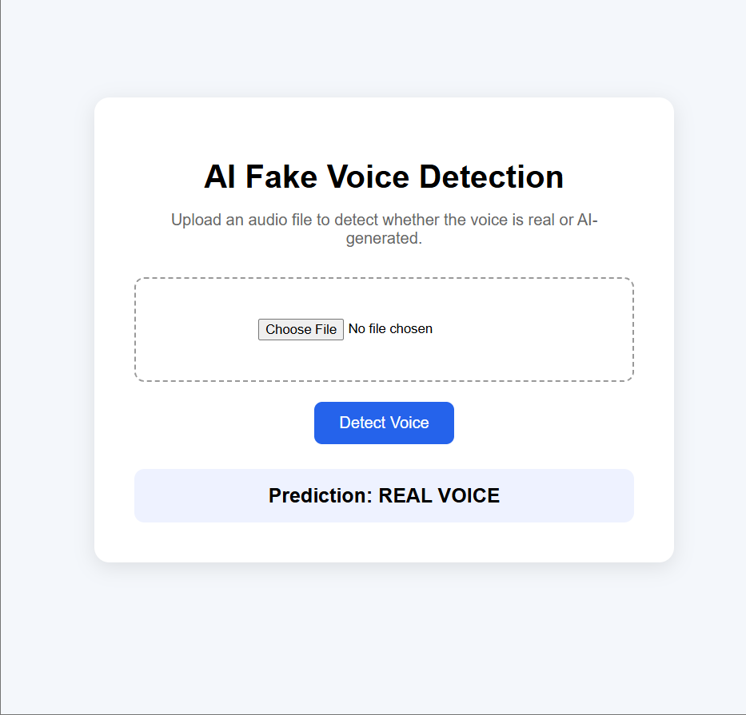
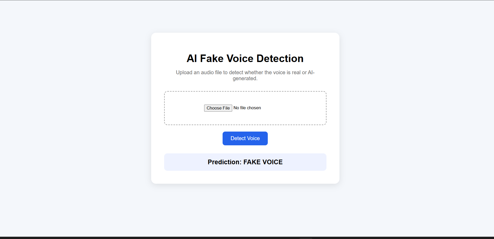

1# AI Fake Voice Detection

An AI-based web application that detects whether an uploaded audio file is a real human voice or an AI-generated/fake voice.

## Features

- Upload `.wav` or `.mp3` audio files
- Extract MFCC audio features
- Classify voice as REAL VOICE or FAKE VOICE
- Simple Flask web interface
- Machine learning model using Scikit-learn

## Technologies Used

- Python
- Flask
- Librosa
- NumPy
- Scikit-learn
- Joblib
- HTML
- CSS

## Project Structure

```text
voice-detection/
├── dataset/
├── features/
├── models/
├── templates/
├── uploads/
├── extract_features.py
├── train_model.py
├── predict.py
├── evaluate.py
├── web_app.py
└── README.md
## Project Demo

### Real Voice Detection



### Fake Voice Detection


